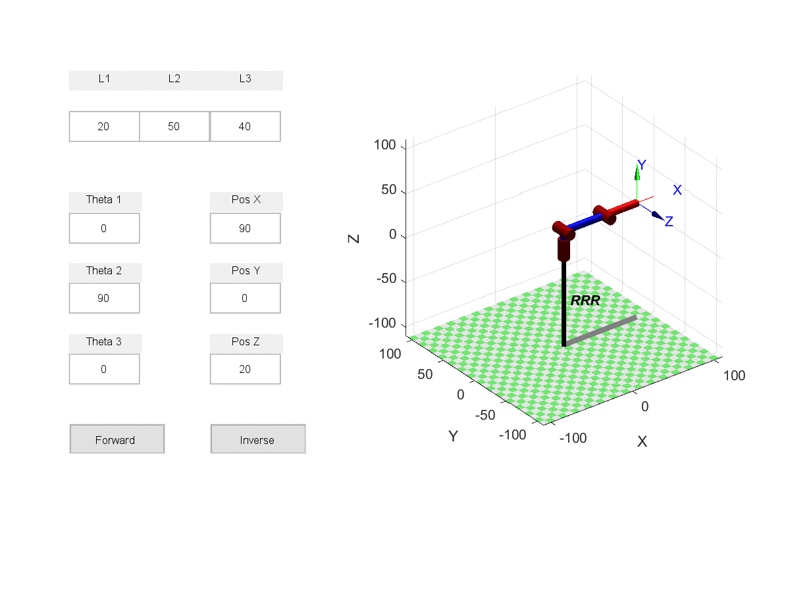
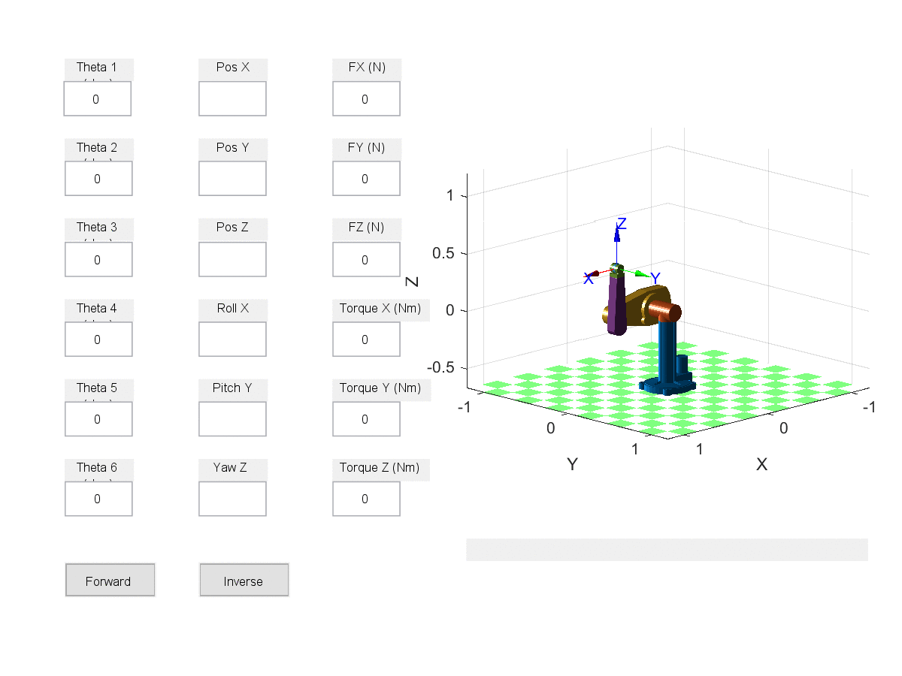

# PUMA560-MATLAB-Simulations

PUMA560 Simulations using Perter Corke's Robotics Toolbox for MATLAB.

## Getting Started

To get a copy of this project you can use git, and clone the repository:

```
git clone https://github.com/leonardoward/PUMA560-MATLAB-Simulations.git
```

Or you can download the zip file with the project and extract it to get the files.

### Prerequisites

1-MATLAB (Developed using MATLAB R2015b)

2-[Peter Corke's Robotics Toolbox](http://petercorke.com/wordpress/toolboxes/robotics-toolbox)

3-[ARTE Library](http://arvc.umh.es/arte/index_en.html): This library contains the needed STL models for the PUMA560.

### Installing

1-[Peter Corke's Robotics Toolbox](http://petercorke.com/wordpress/toolboxes/robotics-toolbox)

- Download the mltbx file, this project was developed using [RTB-10.3.1](http://petercorke.com/wordpress/?ddownload=574).
- From within the MATLAB file browser double click on this file (mltbx), it will install and configure the paths correctly.

2-[ARTE Library](http://arvc.umh.es/arte/index_en.html)

- Download the [zip file with the ARTE Library](http://arvc.umh.es/arte/arte.zip).
- Copy the folder /path/to/arte/arte/robots/UNIMATE/, this folder contains the STL models. A copy of this folder can be found on the root path of this repository.
- Paste the folder with the STL models in the path /path/to/MATLAB/version/toolbox/phased/phased/data/ARTE/,
in this case the version is R2015b.

To check that is installed correctly run in the MATLAB terminal:

```matlab
> mdl_puma560
> p560.model3d
ans =
UNIMATE/puma560
```

## RRR Robot



## PUMA 560



## Authors

* **Leonardo Ward** -  [Github](https://github.com/leonardoward)
