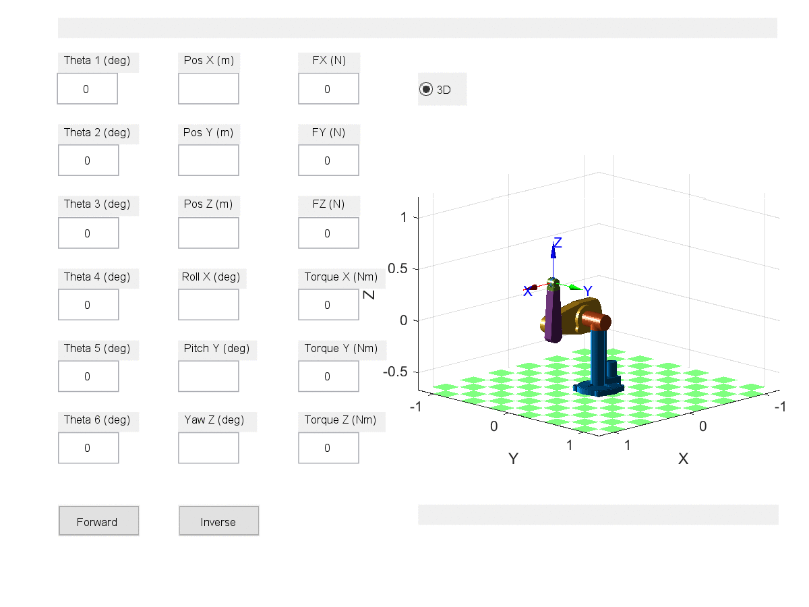
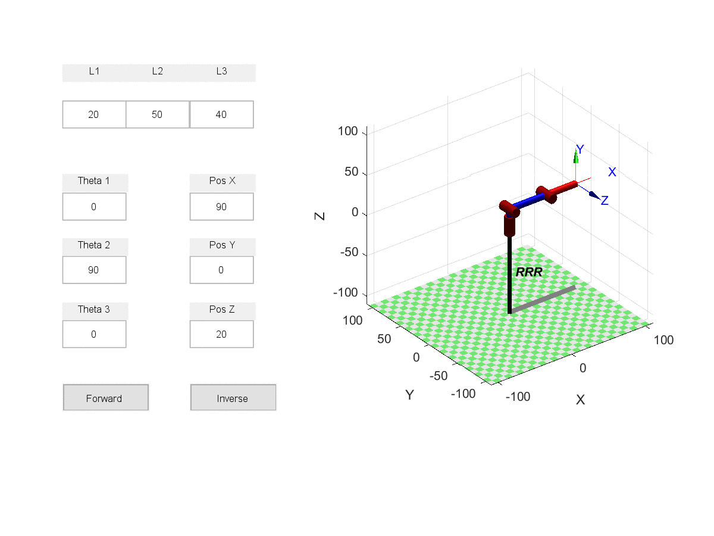

# PUMA560 MATLAB Simulations

Two MATLAB GUIs for exploring serial‑robot kinematics with
[Peter Corke's Robotics Toolbox](https://petercorke.com/toolboxes/robotics-toolbox/):
one for a teaching **RRR** arm (3 revolute joints) and one for the classic
**Unimation PUMA 560** (6 joints), the latter animated with the real STL link
meshes from the [ARTE](https://arvc.umh.es/arte/index_en.html) library.

<p align="center">
  
</p>

## Table of Contents

1. [What the GUIs Do](#what-the-guis-do)
2. [Prerequisites](#prerequisites)
3. [Installing](#installing)
4. [RRR Robot](#rrr-robot)
5. [PUMA 560](#puma-560)
6. [Repository Layout](#repository-layout)
7. [Author](#author)

## What the GUIs Do

### `puma560_gui`

The PUMA 560 GUI (`puma560_gui.m` / `.fig`, built with GUIDE) does a full
forward / inverse kinematics round trip and shows the intermediate robotics maths:

* **Forward kinematics** &mdash; type the six joint angles (degrees). The GUI builds a
  smooth joint‑space trajectory from the previous pose with `jtraj` (10 steps), and for
  every step it computes the **manipulator Jacobian** (`p560.jacobe`), its
  **determinant** and its **rank** &mdash; so configurations near a **singularity** show up
  as a rank drop / determinant collapse. It then animates the trajectory and reads the
  end‑effector pose back out of the forward‑kinematics transform (`p560.fkine`),
  reporting X/Y/Z and roll/pitch/yaw (`tr2rpy`).
* **Statics** &mdash; an optional force/torque vector `[fx fy fz tx ty tz]` applied at the
  end effector is mapped to the joint torques that would hold it, using the
  Jacobian transpose (`q_add = J' * force`), and folded into the displayed trajectory.
* **Inverse kinematics** &mdash; type a target Cartesian pose; the GUI solves for the
  joint angles with `p560.ikine`, then animates the `jtraj` path to it.
* **2D or 3D** &mdash; a toggle switches between the fast wire‑frame plot (`p560.plot`)
  and the textured STL model (`p560.plot3d`); frames are written out to `images/` to
  build the GIFs in this repo.

### `RRR_Robot_GUI`

A stripped‑down version for a 3‑revolute (RRR) arm &mdash; the same forward/inverse
kinematics idea on a robot simple enough to check the maths by hand. The link lengths
are defined directly with `Link([theta d a alpha])` / `SerialLink`.

## Prerequisites

1. **MATLAB** (developed on R2015b).
2. **[Peter Corke's Robotics Toolbox](https://petercorke.com/toolboxes/robotics-toolbox/)**
   &mdash; developed with [RTB&nbsp;10.3.1](http://petercorke.com/wordpress/?ddownload=574).
3. **[ARTE Library](https://arvc.umh.es/arte/index_en.html)** &mdash; provides the STL link
   meshes for the PUMA 560's 3D view (a copy of the `UNIMATE/` folder is included here).

## Installing

**Robotics Toolbox** &mdash; download the `.mltbx` and double‑click it in the MATLAB file
browser; it installs and sets the paths.

**ARTE STL models** &mdash; copy `arte/robots/UNIMATE/` (or the `UNIMATE/` folder from this
repo) into
`.../MATLAB/<version>/toolbox/phased/phased/data/ARTE/`. Check it with:

```matlab
>> mdl_puma560
>> p560.model3d
ans =
UNIMATE/puma560
```

Then run `puma560_gui` or `RRR_Robot_GUI` from the MATLAB prompt.

## RRR Robot



## PUMA 560


## Repository Layout

```
puma560_gui.m / .fig            PUMA 560 kinematics GUI (GUIDE)
RRR_Robot_GUI.m / .fig          RRR arm kinematics GUI (GUIDE)
test.m                          scratch script (Link/SerialLink experiments)
UNIMATE/puma560/                ARTE STL link meshes + PUMA 560 parameters / IK
gif_puma_560/  gif_puma_560_3d/ rendered animations (2D and 3D)
gif_robot_gui/                  rendered RRR animations
images/                         per-frame PNGs the GUIs write for the GIFs
robot.pdf / robot (1).pdf       reference notes
```

## Author

* **Leonardo Ward** &mdash; [GitHub](https://github.com/leonardoward)
